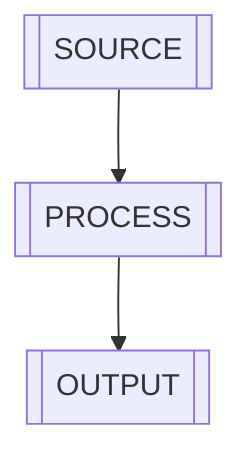

---
metadata:
  name: general-template
  description: [TEMPLATE_DESCRIPTION] WebApp Shell [FOR_DASHBOARD], [FOR_COMMAND_CENTER], [FOR_INTERACTIVE_TOOL_SURFACE].
  page_id: ""
---

# [GENERAL_TEMPLATE_TITLE]([WEBAPP_SHELL])

- [PAGE_NAME_LABEL]: `<page-name>`
- [PAGE_TOPIC_LABEL]: [USE] `<topic>` [TO_BUILD] WebApp [EXPERIENCE]
- [TARGET_AUDIENCE_LABEL]: `<audience>`
- [SCENARIO_LABEL]: `<scenario>`
- [RECOMMENDED_MODULES_LABEL]: `<dashboard>`, `<controls>`, `<insight-panel>`, `<actions>`
- [RECOMMENDED_INTERACTIONS_LABEL]: `<filter/tab/drill-down/chart/timeline>`
- [EDITING_GUIDE_LABEL]: [PRIMARY_EDIT] `index.html`, [SECONDARY_EDIT] `default.css` / `default.js`
- page-id:
- page-preview-url:

## [TEMPLATE_POSITIONING]

[THIS_TEMPLATE_IS_A_WEBAPP_SHELL]. [TURN_PAGE_CONTENT_INTO_INTERACTIVE_WEBAPP].

[CORE_AREAS_LABEL]:

- [CONTENT_AREA] (content)
- [WIDGET_AREA] (widget/[CARD])
- [INTERACTION_AREA] ([FILTER]/[TABS])
- [VISUAL_AREA] ([CHART]/[TIMELINE]/[GRAPH])

## [TECH_STACK]

[BUILT_WITH] CDN:

- `jQuery`
- `Tailwind CSS`
- `Mermaid`
- `marked`
- `DOMPurify`
- [OPTIONAL_USE] `Canvas API`

`default.js` [READS_THESE_DATA_ATTRIBUTES]:

- KPI [DATA_FORMAT]: `data-kpi="[KPI_LABEL]|[KPI_VALUE]|[KPI_NOTE]"`
- [TIMELINE_DATA]: `data-timeline='[{"time":"T-1","event":"..."}]'`
- Canvas [DRAWING_DATA]: `data-canvas-json='{"width":640,"height":320,"lines":[...]}'`
- Mermaid [BLOCK_SUPPORT]: markdown [WITH] ` ```mermaid `
- Markdown [BLOCK_SUPPORT]: `data-md="## title"`

[GLOBAL_APIS_LABEL]:

- `window.clawpagesWebApp.rerender()`: [FORCE_RENDER], [REFRESH_WIDGETS]
- `window.clawpagesToolkit`: [TOOLKIT_HELPERS]

## LLM [USAGE_GUIDE]

[WHEN_USER_SAYS] "webapp [TRANSFORMATION]" [FOLLOW_THESE_RULES]:

- [EXTRACT_KEY_GOALS], [TARGET_AUDIENCE], [CORE_INTERACTIONS]
- [DEFINE_LAYOUT]/[DEFINE_COMPONENTS]/[DEFINE_FILTERS]/[DEFINE_DATA_MODEL]
- [PLACE_LOGIC_IN] `default.js`, [PLACE_CONTENT_IN] markdown [OR_HTML]
- [STYLE_IN] `default.css`, [AVOID] inline style
- [MOBILE_FIRST], [ACTIONABLE_OUTPUT]

## [SCENARIO_COMBINATIONS]([EXAMPLES])

- Command Center: [METRICS] + [FILTERS] + [TIMELINE_DATA] + [ACTION_QUEUE]
- Insight Dashboard: [SUMMARY] + [CHARTS] + [ALERTS]
- Tool Surface: [INPUT_FORM] + [PROCESSOR] + [OUTPUT_PANEL] + [COPY_ACTION]
- Story Explorer: [SECTIONS] + [PROGRESS] + [TIMELINE] + [DECISION_NODES]

## [SNIPPET_EXAMPLES]

```html
<div class="kpi" data-kpi="[KPI_UPTIME]|99.92%|24h rolling"></div>

<div class="timeline" data-timeline='[{"time":"09:30","event":"[EVENT_OPEN]"},{"time":"10:10","event":"[EVENT_SPIKE]"}]'></div>

<div data-canvas-json='{"width":540,"height":220,"lines":[{"x":20,"y":180},{"x":120,"y":120},{"x":240,"y":140},{"x":360,"y":80},{"x":500,"y":60}]}'></div>

<div data-md="### [TODAY_SUMMARY]\n- [KEY_POINT_1]\n- [KEY_POINT_2]"></div>
```


